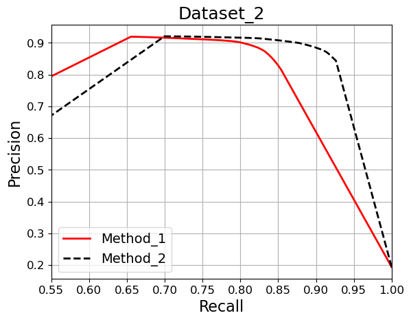
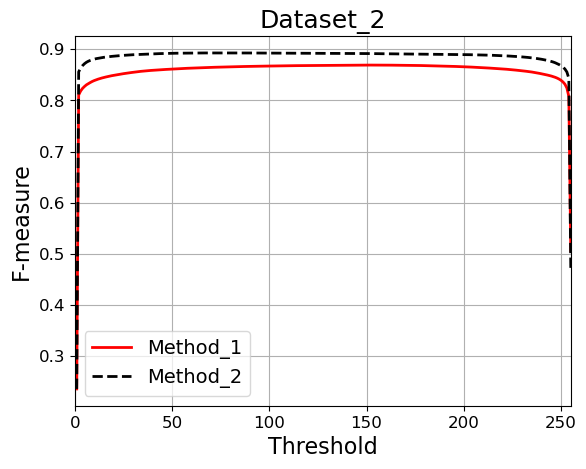

# SOD_Evaluation_Metrics
**A more complete python version (GPU) of the fast evaluation for salient object detection (with S-measure, Fbw measure, MAE, max/mean/adaptive F-measure, max/mean/adaptive E-measure, PRcurve and F-measure curve)**

- Code are reimplemented from the matlab version which are available from http://dpfan.net/, modified from [metricsource1](https://github.com/Hanqer/Evaluate-SOD), [metricsource2](https://github.com/PanoAsh/Evaluation-on-salient-object-detection), and [curvesource3](https://github.com/xahidbuffon/SOD-Evaluation-Tool-Python).

- Evaluating 1000 images (ECSSD, all metrics) costs about 280 seconds.

- The source files should be orginized as follows:

      --gt/
            --Dataset_1/
                --img1.png
                --img2.png
                    ...
            --Dataset_2/
                ...
      --pred_maps/
            --Method_1/
                --Dataset_1/
                    --img1.png
                    --img1.png
                        ...
                --Dataset_2/
                    ...
            --Method_2/
                ...

- Evaluate your map by run: 
  
  `python main.py --pred_root_dir ./pred_maps/ --gt_root_dir ./gt/ --save_dir ./score/`

- The format of the result file is shown as [this](./score/result.txt).

  `#[Dataset_Name] [Method_Name]# [value mae], [value max-fmeasure], [value mean-fmeasure], [value9 adp-fmeasure], [value max-Emeasure], [value mean-Emeasure], [value adp-Emeasure], [value S-measure_alpha05], [value Fbw-measure].`

- Draw the PR curve and F-measure Curve by run:
  
    `python draw_curve.py`
  
  Then, the image file will be saved to './score/'. Two virtual curves are shown as follows:

| PR curve: Dataset_2  | F-measure curve: Dataset_2 | 
|:--------------------|:----------------
|  |    | 

- The above metrics are related to the following papers:

      @inproceedings{Fmeasure,
          title={Frequency-tuned salient region detection},
          author={Achanta, Radhakrishna and Hemami, Sheila and Estrada, Francisco and S{\"u}sstrunk, Sabine},
          booktitle=CVPR,
          number={CONF},
          pages={1597--1604},
          year={2009}
      }
      
      @inproceedings{MAE,
          title={Saliency filters: Contrast based filtering for salient region detection},
          author={Perazzi, Federico and Kr{\"a}henb{\"u}hl, Philipp and Pritch, Yael and Hornung, Alexander},
          booktitle=CVPR,
          pages={733--740},
          year={2012}
      }
      
      @inproceedings{Smeasure,
          title={Structure-measure: A new way to eval foreground maps},
          author={Fan, Deng-Ping and Cheng, Ming-Ming and Liu, Yun and Li, Tao and Borji, Ali},
          booktitle=ICCV,
          pages={4548--4557},
          year={2017}
      }
      
      @inproceedings{Emeasure,
          title="Enhanced-alignment Measure for Binary Foreground Map Evaluation",
          author="Deng-Ping {Fan} and Cheng {Gong} and Yang {Cao} and Bo {Ren} and Ming-Ming {Cheng} and Ali {Borji}",
          booktitle=IJCAI,
          pages="698--704",
          year={2018}
      }
      
      @inproceedings{wFmeasure,
        title={How to eval foreground maps?},
        author={Margolin, Ran and Zelnik-Manor, Lihi and Tal, Ayellet},
        booktitle=CVPR,
        pages={248--255},
        year={2014}
      }